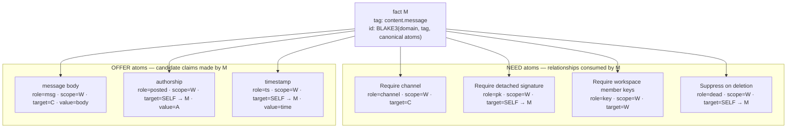
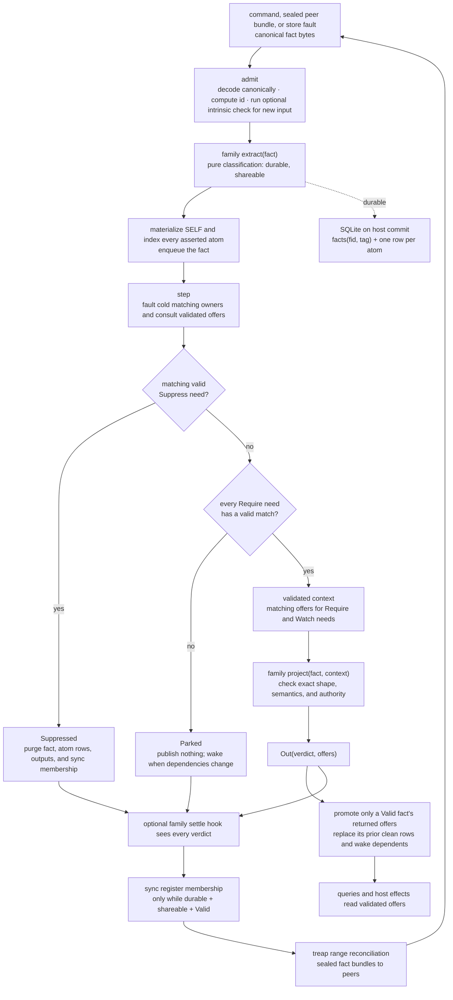

# TinyP2P — the atom model

TinyP2P is an executable proof of concept for a small local-first, peer-to-peer
backend for collaboration applications such as team chat. It explores whether
identity, validation, storage, demand-driven loading, synchronization, transport,
and application behavior can share one data language instead of accumulating a
separate mechanism for each concern.

That language is made of immutable facts containing needs and offers called
atoms. Facts are the units of identity and wire transfer; atoms are the units of
storage and matching. A command authors a fact, the kernel matches its needs
against validated offers, and the owning fact family decides what the fact
means. The same model represents workspaces, membership, messages, deletions,
peer connections, sync compares, timers, and queues.

The implementation is intentionally compact and inspectable, and is not
production software. The concrete protocol currently demonstrates workspace
and invite authority, member-signed messages and reactions, signed deletion and
retention policy, self-verifying file attachments, demand-driven SQLite
hydration, sealed peer sessions, and dependency-aware set reconciliation.

The design of record is [`DESIGN.md`](DESIGN.md).

## How it works

### Facts are canonical sets of atoms

A fact has a dotted family tag and a canonical, sorted set of atoms. Its id is
the BLAKE3 hash of the protocol domain, tag, and encoded atoms, so changing any
atom creates a different event. An atom is the small relational statement
`(kind, role, scope, target, value?, effect?)`:

- an **offer** is a candidate claim, such as a message body at a channel id;
- a **need** looks for offers with the same role and scope whose point or range
  target matches; and
- a need's effect says whether the match is required, merely watched, or
  suppresses the owning fact.

For example, a member-signed message is one fact containing seven atoms. In
this diagram `W` is the workspace id, `C` the channel fact id, `A` the author
member id, and `M` the message fact id:



`SELF` is encoded as a symbolic target, which avoids a hash cycle while the
fact id is being computed. In the match index and atom store it is materialized
as `Exact(M)`. The `channel` need therefore links the message to a
validated channel, the `pk` and `key` needs bring its detached signer and
workspace authority into context, and a matching `dead@M` offer suppresses and
physically purges it. The `msg` and `posted` atoms do not become trusted merely
because they occur in the fact: they are asserted candidates until the family
projector publishes them.

### Extraction and projection

Every fact follows the same admission and evaluation pipeline. The root router
uses the type tag to select the owning family for both `extract()` and
`project()`:



Despite its name, `extract()` does not unpack the atoms. It is a content-pure
policy decision made at admission: `durable` decides whether the canonical
fact is retained in the atom relation, while `shareable` makes a valid,
durable fact eligible for the sync family's treap. Local secrets and connection
anchors are durable but unshareable; protocol work such as sync compares and
outbox sends is neither.

The projector is the fact family's semantic boundary. It runs only after no
validated suppressor matches and every `Require` need is satisfied. Its
context contains matching **validated** offers for `Require` and `Watch`
needs, including each offer's owner and timestamp. The projector normally
rebuilds the expected family shape, applies authorization or cryptographic
policy, and returns `Out(offers=...)`. Only those returned offers enter the
clean index read by dependents and queries; raw asserted offers never justify
another fact on their own. `Parked`, `Invalid`, `Suppressed`, and family-chosen
`Reap` verdicts publish no clean offers. A family's `settle()` hook observes
every verdict, including ones that never call the projector, which is how sync
maintains its own leaf set and treap in `node.regs[b"sync"]`.

SQLite does not store canonical fact blobs. Its durable relation is a
two-column `facts(fid, tag)` spine plus one `atoms` row for every atom. Reads
regroup those rows, reconstruct the canonical fact, re-encode it, and verify
that it hashes to `fid`. Corrupt or inconsistent rows are therefore a miss,
not a different fact. Validity, resident fact objects, match buckets, sync
labels, family registers, and queues are derived state.

The main pieces are:

- [`kernel.py`](kernel.py) — canonical identity, admission, matching, the
  bounded turn loop, demand faults, and two generic family-index seams:
  `settle()` and `answer()`.
- [`facts/`](facts/) — one module per fact family. Each module owns SHAPE,
  EXTRACT, optional CHECK, PROJECT, COMMANDS, QUERIES, and CLI. Projectors are
  also the routing tree, so protocol policy stays out of the kernel.
- [`facts/sync/index.py`](facts/sync/index.py) — the sync family’s own
  rebuildable register: leaf membership, a history-independent Merkle treap,
  summary memo, and version counter. The kernel contains no sync tree.
- [`facts/connection/`](facts/connection/) — sealed handshake, session,
  frame-bundle, close, and ephemeral-secret families. A durable answered
  request remains the known-peer anchor and redials only when its session is
  down.
- [`bin/tinyd.py`](bin/tinyd.py) and [`bin/runtime.py`](bin/runtime.py) — the
  single-writer daemon and its socket-free host-turn seam. The daemon performs
  no database-wide boot load; it demands local identity plus whatever later
  queries and hydrate facts request from the atom store.
- [`bin/tiny.py`](bin/tiny.py) — a thin client for
  `tiny <db> <scope.fact.verb> [args...]` over `<db>.sock`.
- [`tests/`](tests/) — kernel contracts, randomized order and adversarial
  storage cases, hydration, sync and reliability properties, and real
  multi-daemon stories over sockets.

## Current scope

The prototype has a global resident sync set per node. Workspace-scoped sync
lanes and negative multi-workspace isolation are not implemented yet. Also,
`LocalOnly` currently controls sync egress but is not enforced on wire ingress,
so the present threat model assumes connected peers do not send local-only
families. Retention-policy enforcement remains outside the implemented surface.

## Quick start

Python 3.13 is used on the build machine. Install the runtime and test
dependencies; building the ABI3-compatible Bao binding requires Cargo:

```bash
python3 -m pip install pynacl blake3 pytest ./native/bao_py
```

Start the daemon in one terminal:

```bash
bin/tinyd.py w.facts --listen 127.0.0.1:41000
```

Then use the CLI from another terminal:

```text
$ bin/tiny.py w.facts auth.workspace.create acme
<workspace-id>
$ bin/tiny.py w.facts auth.active_workspace.use <workspace-id>   # select it; verbs may now omit wid=
$ bin/tiny.py w.facts content.channel.list
<channel-id> general
$ bin/tiny.py w.facts content.channel.create random
<channel-id>
$ bin/tiny.py w.facts content.message.send general hello there    # multi-word body; author is the local signer
<message-id>
$ bin/tiny.py w.facts content.message.feed general
hello there
$ bin/tiny.py --commands | grep content.message                   # discover verbs (needs no daemon)
```

`auth.workspace.create` authors a replicated, member-signed `general` channel.
Additional channels are `content.channel` facts: their fact ids are routing ids
and their bounded UTF-8 names are display data. Message commands accept either
a validated name or a 64-hex channel id. A message cannot validate until the
exact channel fact, its signature, and its workspace authority closure are
valid, so channel lists and isolated feeds converge across peers instead of
depending on local aliases that happen to share a string.

The content verbs share one deterministic grammar: ambient context rides as
keyed tokens — `wid=<64hex>` (else the workspace selected by
`auth.active_workspace.use`, or the sole workspace) and `t=<int>` (else now) —
so a numeric or hex-looking body is never re-read as a workspace or a timestamp.
Everything else is a positional in the verb's order; a message body is the
trailing words, joined. `tiny --commands` lists every verb and
`tiny --completion bash` prints a shell completion; both run without a daemon.

The daemon starts cold. A normal query faults only the keys it needs;
`bin/tiny.py w.facts store.hydrate.pull` explicitly makes the complete durable
set resident, which is also required before claiming full sync coverage.

Run the tests and performance harness with:

```bash
pytest -q
python3 bench/bench.py
```

Attach, inspect, and save a file through the same daemon-owned fact store:

```
$ bin/tiny.py w.facts content.file.send <wid> general al "see attached" ./notes.txt text/plain
message_id: <message-fact-id>
file_fact_id: <descriptor-fact-id>
file_id: <content-instance-id>
filename: notes.txt
mime: text/plain
blob_bytes: 1234
total_slices: 1
$ bin/tiny.py w.facts content.message.view <wid> general
see attached
  file: notes.txt (1234 bytes, complete)
$ bin/tiny.py w.facts content.file.list <wid>
FILES (1 total):
1. complete notes.txt (1234 bytes, 1/1 slices, 100%)
$ bin/tiny.py w.facts content.file.save <wid> 1 ./saved-notes.txt
```

Attachments are ordinary descriptor and 256 KiB slice facts, capped at 10 GiB.
Every slice carries its bytes in a canonical Bao range proof and verifies
independently against the descriptor's BLAKE3 root, so only proven slices count
toward progress or save. Descriptor metadata is first-class atom vocabulary,
not a nested record. `content.message_deletion.delete` removes the message,
descriptor, and every slice from memory, SQLite, and sync state. Payloads
currently use the same confidentiality boundary as message bodies: `clear-v1`
bytes at rest and sealed established-connection frames in transit.

## Performance

These numbers were measured on the build machine with Python 3.13.7. The
standard corpus is 10,000 signed messages: each message and its detached
signature is a separate durable fact, so the load contains about 20,000 facts
plus the small authority spine. Rates described as messages per second include
both facts and their validation work.

| path | measured cost |
|---|---:|
| admit + settle 10k signed messages / 20k facts | 2.22 s (0.111 ms/fact) |
| rebuild the same set from atom rows with one total demand | 2.96 s |
| daemon cold boot (no database-wide hydration) | 0.040 s |
| hydrate the full signed-message database through one verb | 3.16 s |
| one CLI verb through a hydrated daemon | 0.024 s |
| fault a 100-deep `Require` spine from one keyed demand | 5.60 ms (56.0 µs/hop) |
| `feed()` over 10k messages | 1.67 ms |
| reconcile a one-fact diff in the ~20k-leaf set | 0.018 s, 14 frames, 51.3 KiB |
| two daemons, sustained author / convergence rate | 901 / 721 signed messages/s; 2.00 MB/s |
| query latency during sustained sync | 1.69 ms |
| fresh-peer catch-up of 5k signed messages | 1,364 messages/s (~2,728 facts/s), 3.87 MB/s |
| newest message visible on a caught-up peer | 0.55 s |
| Ed25519-gated signature admission | 10,534 facts/s; replay verifies 0 signatures |

Full hydration reconstructs each selected fact from atom rows and rebuilds
derived indexes, so a total pull scales with the stored atom set. Point matching
uses indexed buckets; a point lookup does not scan every same-role row. Sync
range fingerprints use the treap’s clamped Merkle labels and take expected
`O(log n)` local work, while mismatch depth is `O(log_B n)` and a fresh replica
still transfers `O(n)` facts. Sync covers the resident set, so a node that wants
whole-database reconciliation first issues the total hydrate demand.
